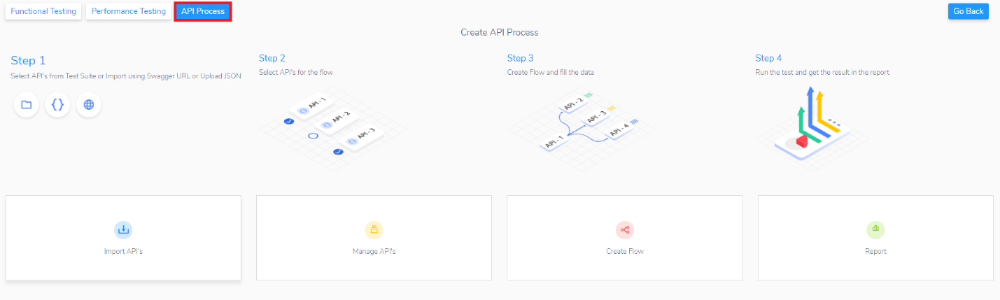
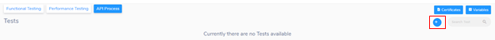
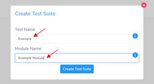
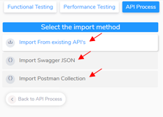
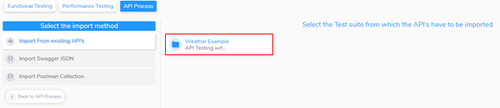
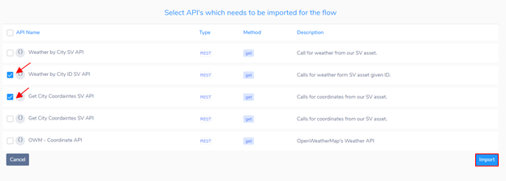
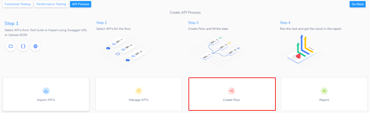
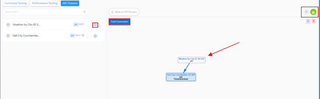

<h1 style="text-align: center; text-decoration:underline; font-weight: bold;">API Testing</h1>

# Getting Started
## Import to API Process

Navigate to API Process, click on the ‘API Process’ tab on the top left of the screen.  

### Creating New Tests Suites
After selecting ‘API Process’, click the ‘+’ icon on the top right of the screen to create a new Test Suite

After clicking the icon, the user will fill out a form that will require to enter a test suite name and a module name.

### Importing Test Scripts
When importing APIs, there are three options available.

1. Importing from Existing APIs
1. Import Swagger JSON
1. Import Postman Collection

### Importing from Existing APIs
After selecting ‘Importing from Existing APIs’, a list of the user’s Test Suites will appear. Click on the desired Test Suite.

After choosing a desired Test Suite, a list of all the API calls that are associated with that Test Suite will appear. Click the check box associated with the API call and then click the import button.

## Connecting Tests together with Flow

After clicking on ‘Create Flow’, the user will be able to create connections for their APIs. This can be done by clicking on the ‘+’ icon on the left panel that’s associated with the API they want to add. 

After adding at least two APIs, a user can create a connection by clicking on the ‘Add Connection’ button on the top left of the page, then dragging an arrow from one API to another.

After creating a connection, click on the ‘Save’ icon on the top right of the page. Then the user will click on the ‘Next Page’ icon directly to the left of the ‘Save’ icon.

When the user clicks on ‘Next Page’ they will be able to see ‘Connection 1’. From here, the user will enter the JSON path, a parameter and a key name. 

The user will then click on the ‘Save’ icon and then run the test.

