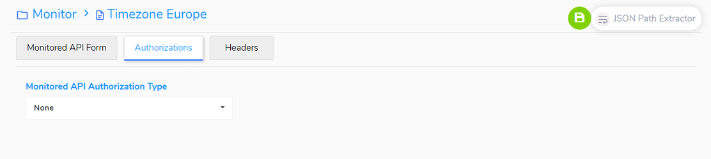

<h1 style="text-align: center; text-decoration:underline; font-weight: bold;">API Monitoring</h1>

# Adding Monitored APIs to a Collection
## Authorizations  {docsify-ignore}  

If the API implements basic authorization or Oauth 2.0 authorization, these can be set in the Authorizations Tab. For more information on these settings, see the Knowledge Base document.

 