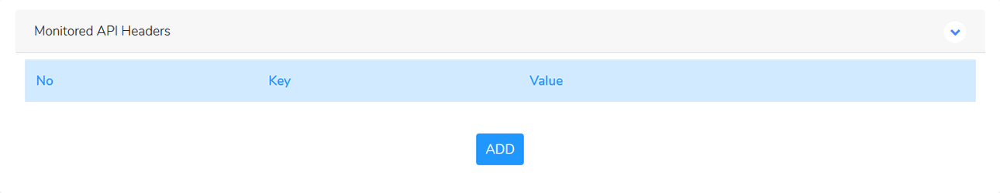
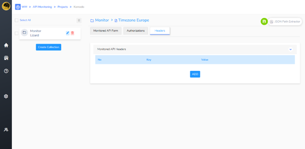
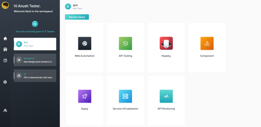

<h1 style="text-align: center; text-decoration:underline; font-weight: bold;">API Monitoring</h1>

# Adding Monitored APIs to a Collection
## Headers  {docsify-ignore}  

Any Headers that are required by the API can be added in the Headers Tab.

 

Clicking on 

 

will display two fields where a key and value pair can be entered. If the API doesn’t require any additional headers, make sure not to add any additional headers.

Save the API by clicking on 

 

, located in the top right hand corner of the page. 

 

If the API was created, a confirmation message will appear in the bottom right hand corner.

 

Clicking on the collection name will show the newly-created Monitored API in the list of Monitored APIs.

 
