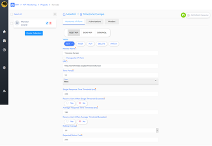
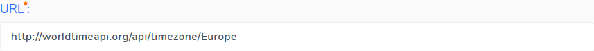
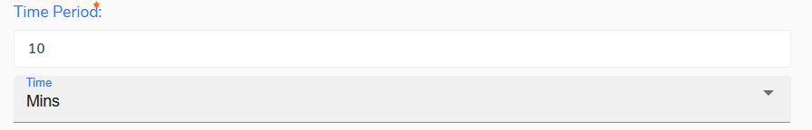
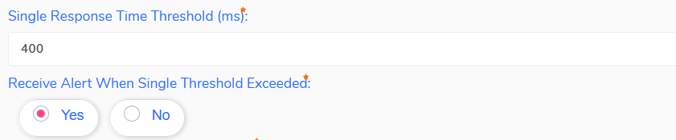
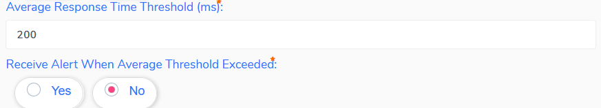
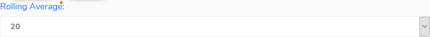

<h1 style="text-align: center; text-decoration:underline; font-weight: bold;">API Monitoring</h1>

# Adding Monitored APIs to a Collection
## Monitored API Form  {docsify-ignore}  

This guide shows how to build a basic Monitored API. See the Knowledge Base for additional information on how add additional options to a monitored API.

 

A basic Monitored API requires a few settings:

- API Type: REST, SOAP, GRAPHQL

 

- Request Type: GET, POST, PUT, DELETE, PATCH

 

- Monitor Name: A name for the monitored API

 

**URL:** The exact URL to the API you will be testing. Include all path and query parameters.

 

- Time Period: The time interval between calls to your API. The minimum is 10 minutes, but can be set in minutes, hours or days.

- Single Response Time Threshold: If an API call takes longer than the threshold set here, an alert can be sent to the email that was entered when setting up the collection

 

**Average Response Time Threshold:** If the average response time of a designated number of calls goes beyond the threshold set here, an alert can be sent to the email that was entered when setting up the collection

 

**Rolling Average:** The value set here determines the number of API calls that are used to determine the current average response time value

 

**Expected Status Code:** This is the status code the API must return in order for the API call to be considered successful

 