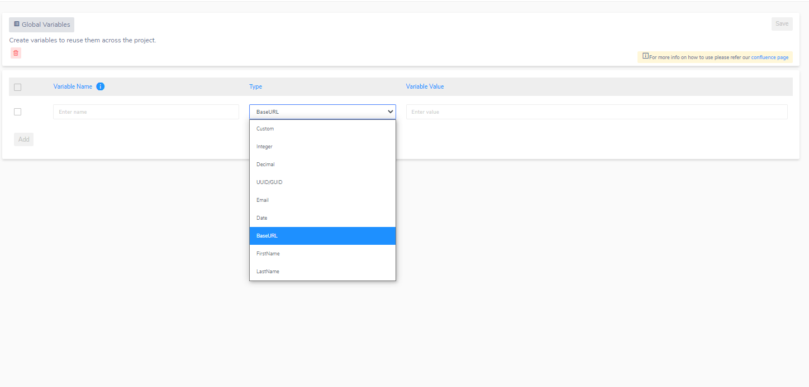

<h1 style="text-align: center; text-decoration:underline; font-weight: bold;">Component</h1>

# Configuration
## Global Variables<!-- {docsify-ignore} --> 
This is where you will create global variables that can be used throughout the entire service you are using, in this case, the component service. To test repetitive and main variables create them here so you can get access to them by calling them with **# <variable-name> #**

**List of types of variables:**

- Custom – any value you want from strings to integers to double to booleans
- Integer – any whole number 
- Decimal – any decimal number
- UUID/GUID - Unique Identifier that is used to hold information unique to the specific ID you give. GUID are used for microsoft software
- Email - any strings that are attached with *@email.com*
- Date - any date that follows the **dd-MM-yyyy format**
- BaseURL - any form of base URL I.e. **google.com** 
- FirstName - any first name
- LastName - any last name

