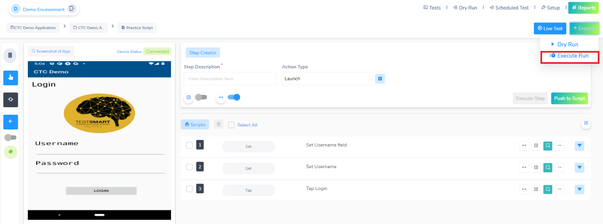
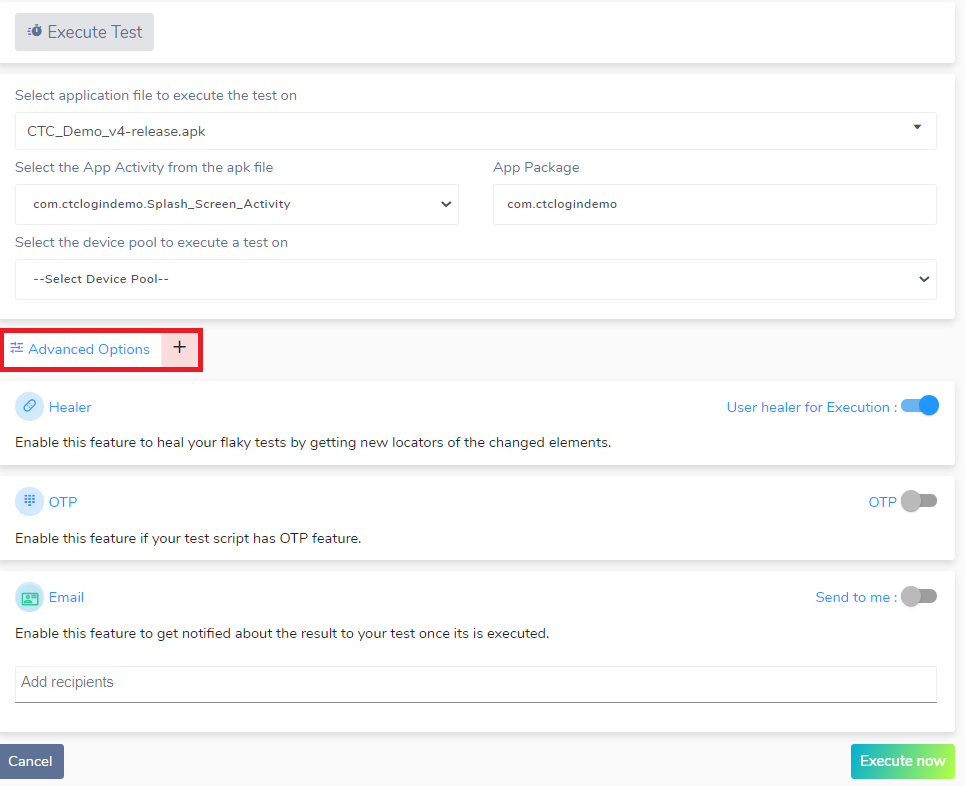
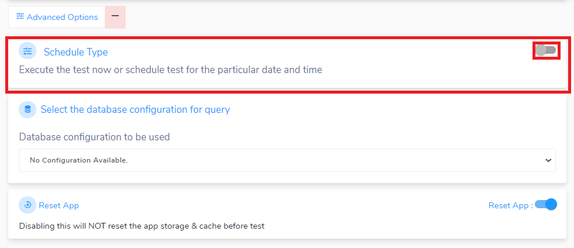
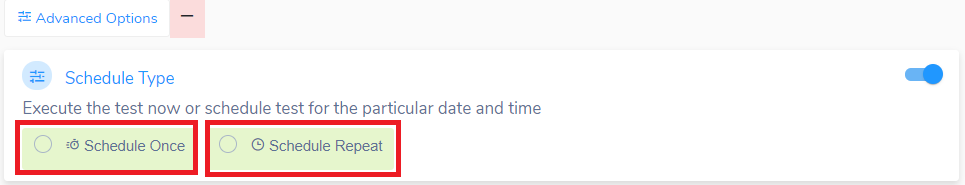
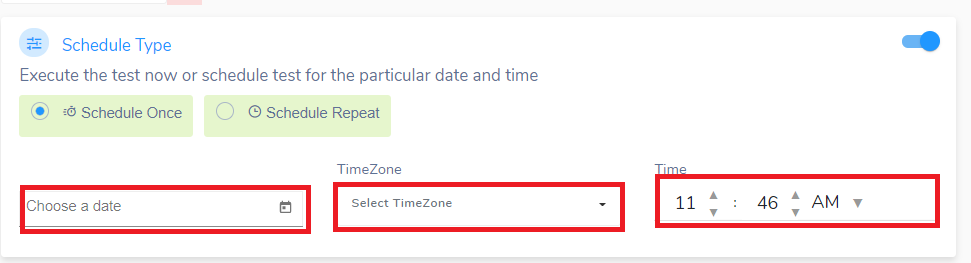
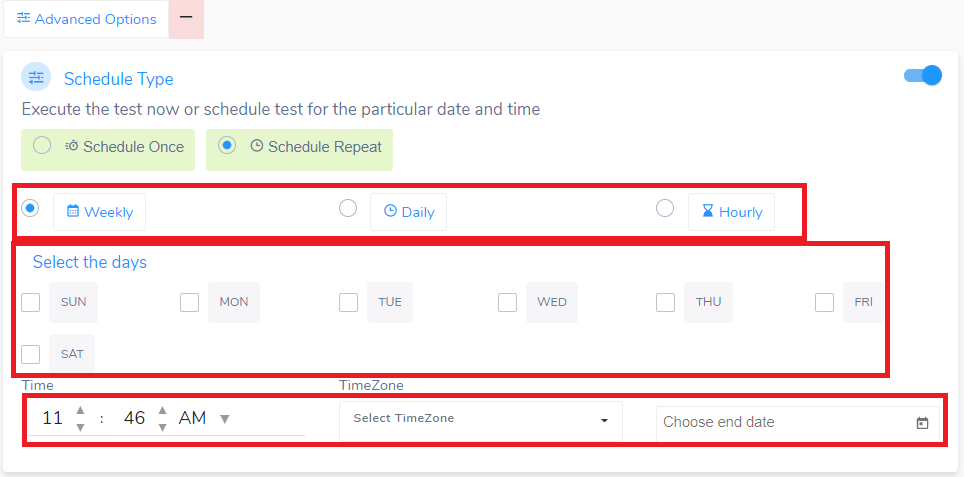
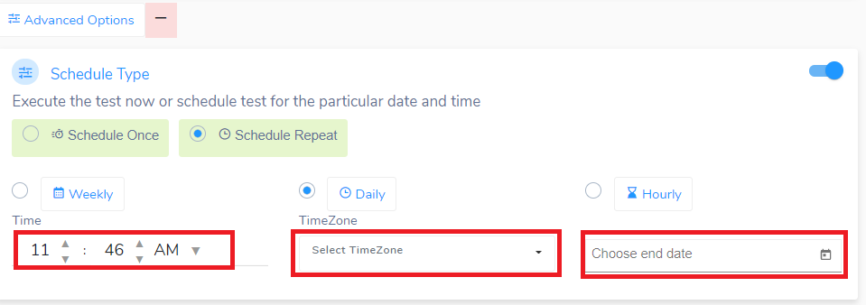

<h1 style="text-align: center; text-decoration:underline; font-weight: bold;">Mobility</h1>

# Executing Tests & Viewing Reports

## Scheduling Test Executions <!-- {docsify-ignore} --> 

**Note:** Scheduling test takes place when you “Execute Run”

Click on “Advanced Options”

Select the toggle for the “Schedule Type”

The toggle will prompt you with two options: **Schedule Once** and **Schedule Repeat**

For ***Schedule Once***, choose your date, time zone and time

For ***Schedule Repeat***, you have the option to run your script Weekly, Daily, and Hourly.

For ***Weekly***, check the box with the days you want to run your tests with the time, time zone, and end date.

For ***Daily*** and ***Hourly***, fill out the time, time zone, and end date

