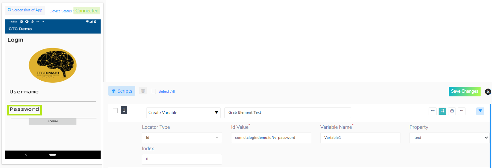
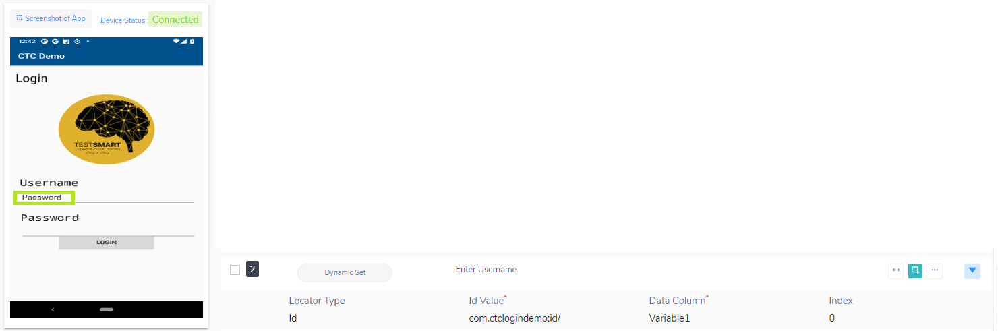
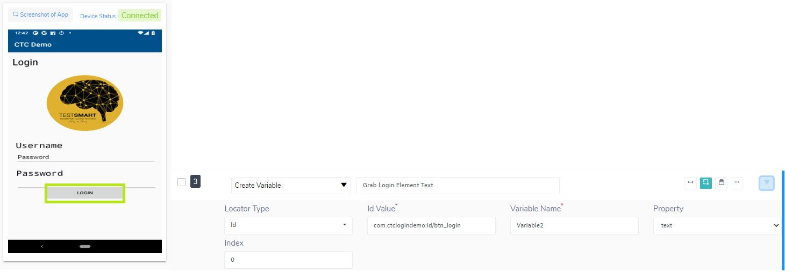
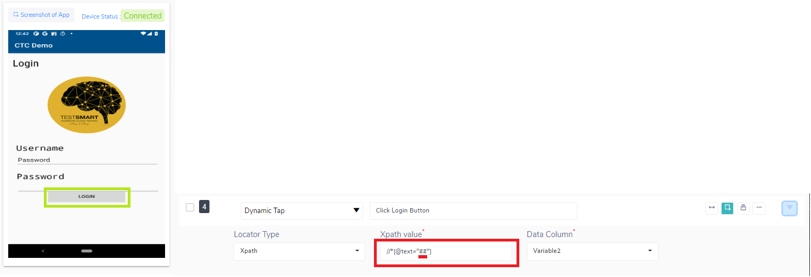

<h1 style="text-align: center; text-decoration:underline; font-weight: bold;">Mobility</h1>

# Other 
## Using Dynamic Action Types <!-- {docsify-ignore} --> 
Qyrus allows users to create variables during test execution and use those values dynamically to perform a wide variety of actions. For a full list of actions, visit our Action Types Documentation (link here). 
### Perquisites
- Created Project 
- Created Suite
- In progress of completing Script
### Example 1 - Dynamic Set
1. In your script, add a step with the action type ‘Create Variable’ to grab the text of the desired element. In our case, we will be taking the text “Password” and will be storing into a variable called “Variable1”

2. Use the ‘Dynamic Set’ action type in order to set a field with the value stored in the variable. In our case, we are going to enter the value in our “Variable 1” to the username text field.

### Example 2 - Dynamic Tap

1.	In your script, add a step with the action type ‘Create Variable’ to grab the text of the desired element. In our case, we will be taking the text “LOGIN” and will be storing into a variable called “Variable2”

2.	Use the ‘Dynamic Tap’ action type in order to click on an element using the value stored in the element. In order to use the value, enter the two pound symbols ‘##’ inside of the element locator value field. In our case, we want to click on an element that has the text of the value we stored in “Variable2” which will be the ‘Login’ button

