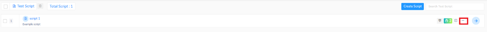
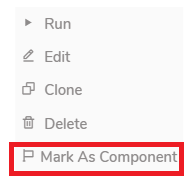
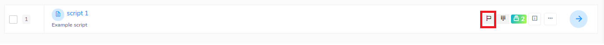
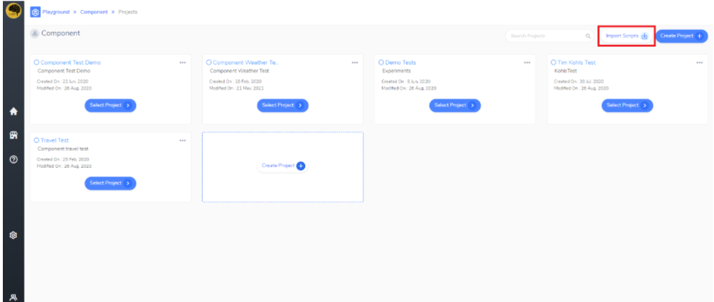
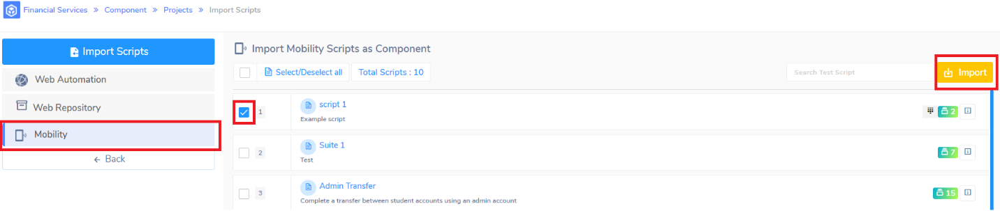

<h1 style="text-align: center; text-decoration:underline; font-weight: bold;">Mobility</h1>

# Other 
## Marking Script for Component Importing <!-- {docsify-ignore} --> 
Qyrus allows users to reuse test scripts across multiple different solutions. Users are able to move test scripts from the Mobility over to Component Testing pretty easily. 

### Prerequisites
- Knowledge in Mobility 
- Knowledge in Component Testing 
- Tests to Import 

### Usage
1. Click on the ‘more options’ button for the script that you want to import

2. ` `Click on ‘Mark As Component’ option

3. When done correctly, the script will have this ‘Flag’ symbol

4. Go to Component Testing and click the “Import Scripts” button. 

5. Then, select Mobility, whichever scripts to import, and click the “Import” button.

