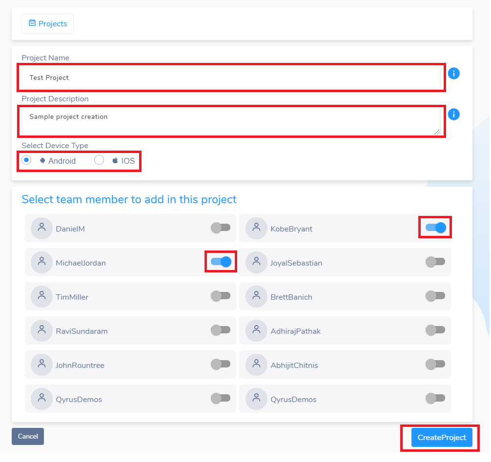

<h1 style="text-align: center; text-decoration:underline; font-weight: bold;">Mobility</h1>

# Test Setup & Building

## Project Creation <!-- {docsify-ignore} --> 
1. Click on Mobility 
2. Click on ‘New Project’ 
3. Enter a project name 
4. Enter a project description  
4. Select Device Type
5. Checkmark any teammates that will be working on the project 
6. Click ‘Create Project’  

## Build a Project

<video width="600px" height="400px" controls>
  <source src="/_webrepo/_projectcreation/../../_media/_videos/_webVideos/Clip9-worksheet2.mp4" type="video/mp4">
</video>

<!-- create project/create suite video -->
