<h1 style="text-align: center; text-decoration:underline; font-weight: bold;">Mobility</h1>

# Test Setup & Building

## Test Scripts <!-- {docsify-ignore} --> 

### Prerequisites 
- Created Project 
- Created Suite

### Creating Scripts Manually

**Step 1:** User can also ***Create Test Script*** using ***Create Manually Test Script*** option by entering ***Test Script Name, Module Name*** and ***Objective*** of the test script.

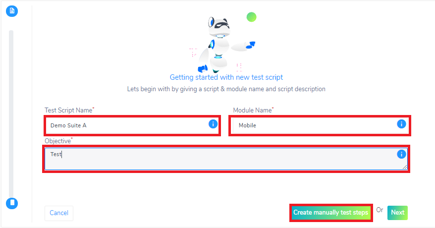

**Step 2:** Your script is now created. Click on the icon highlighted below to start building the action steps with the device. 

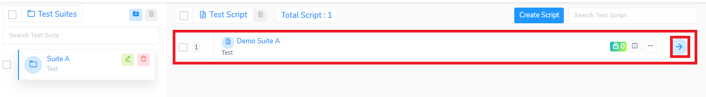

**Step 3:** Tap on the device icon highlighted below to make the device screenshot panel disappear 

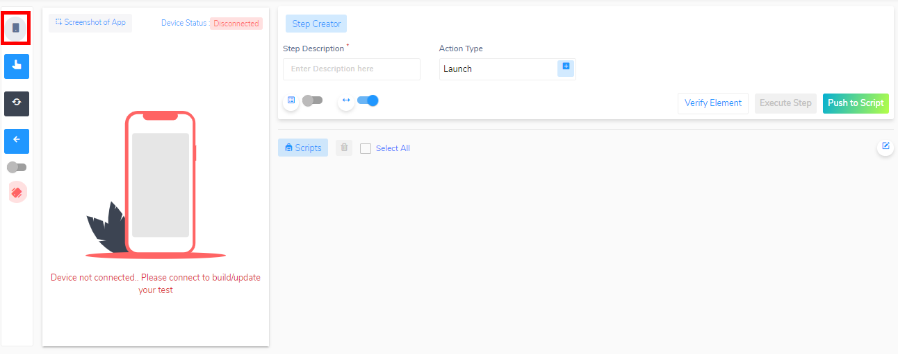

Now you are ready to start building your test script

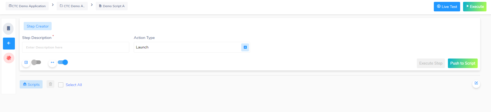

### Creating Scripts Using Live Test

- **Objective**: Get Mobile device to web browser
- **Set Up**: APK/IPA upload and Device Pool configuration

After creating the project and test suite, now we can Create a Test Script

**Step 1:** Click on the Create Test Script Button

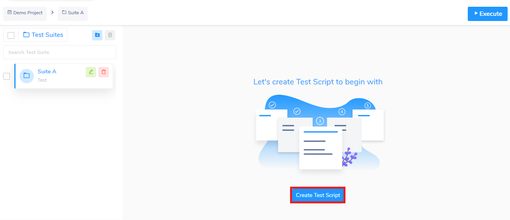

**Step 2:** Enter the Test Script Name, Module Name, and the Objective of your test script. The Next button helps the user to select the application and choose the device created from the device pool section. 

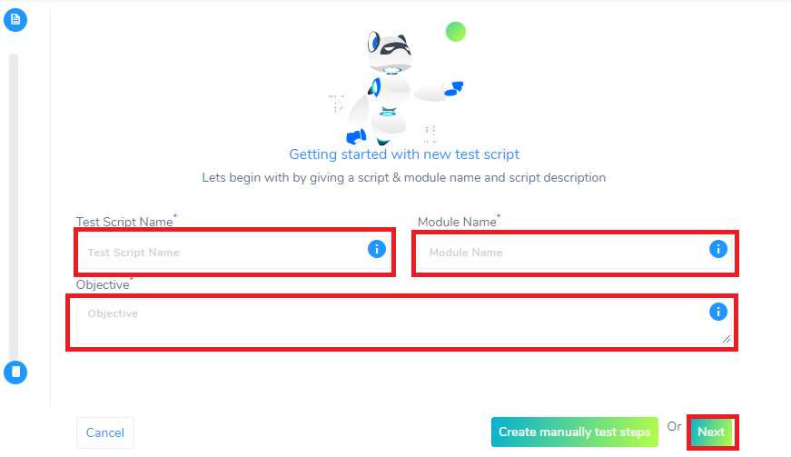

**Step 3:** Choose your APK/IPA file and Device Pool that you had uploaded in the Setup section
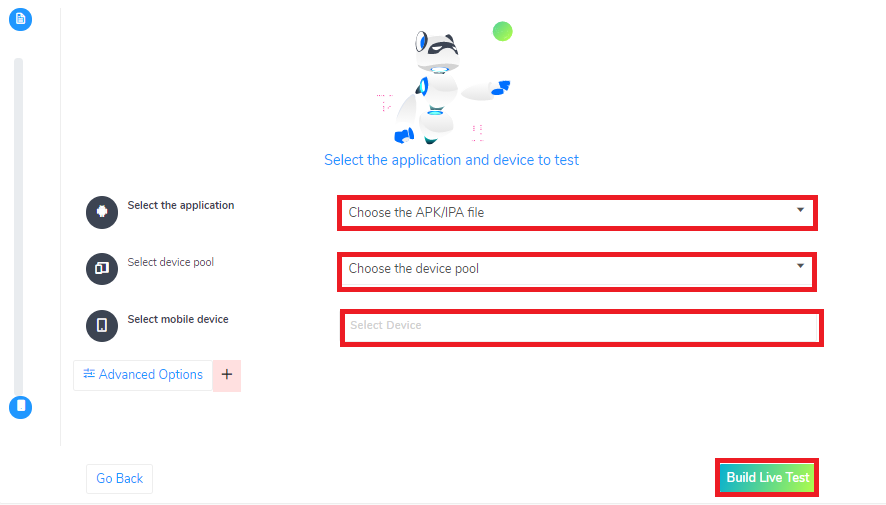

**Step 4:** You will then be asked to select your App Activity

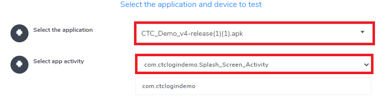

**Step 5:** After selecting your device, you will be able to see the status of the device highlighted below. 

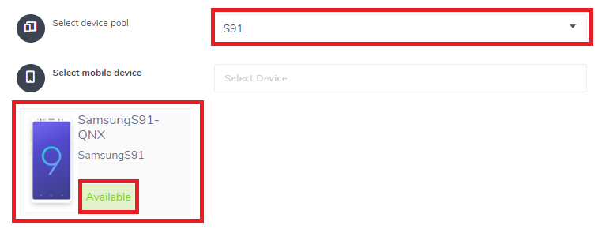

**Step 6:** Click the “Build Live Test” button

Now you are ready to start building your test script

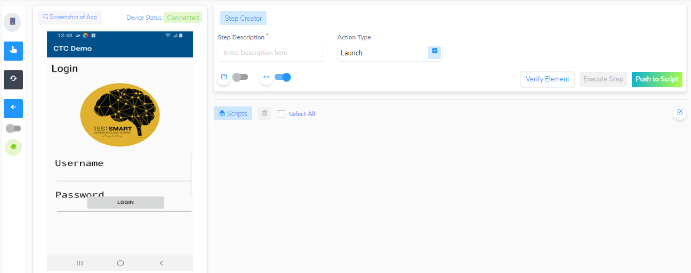

Users also have an option to ***import the scripts to Restore point***. After selecting your APK/IPA file and device pool, users should click on ***Advanced Options*** to ***import the scripts***.

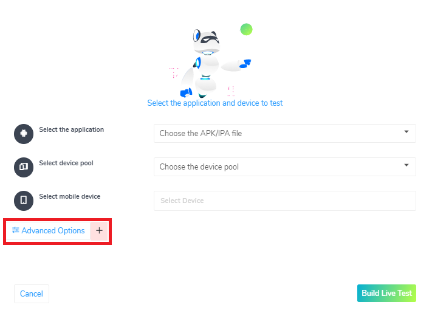

Click on ***Import test script to restore point*** button so you can see the list of suites.

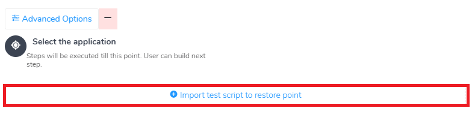

After clicking on suite, user can see the list of scripts, select the script*** which needs to be imported and click on ***Import*** button.

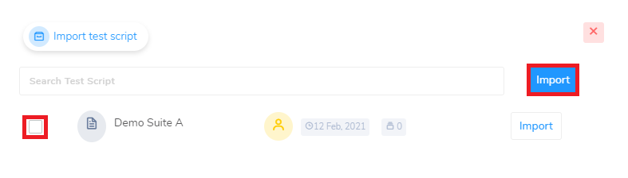

After importing the script user should click on the ***Build Live Test*** button.

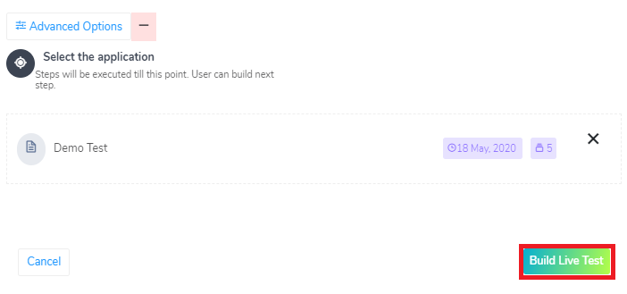

### Interacting with device during live test building
This section covers connecting to a device and details of the icons in interacting with the device. 

If you are not connected to a device, click on the highlighted button as shown below to connect to a device.

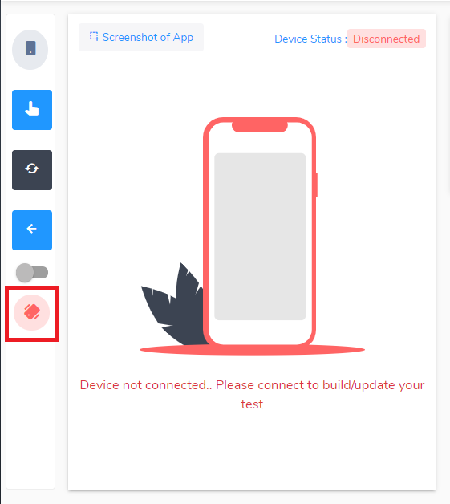

Once you are connected, you are able to interact with the device using these buttons

1. Click on the ‘grey mobile device’ button to hide the device
2. Click on the ‘Mouse Cursor Hand’ button to get the coordinates on the device using your mouse
3. Click on the ‘Refresh’ button to get an updated screenshot of the device
4. Click on the ‘Back’ button to go back to the test page
5. Click on the ‘Quick Search’ toggle fetch locator values that are quicker to find
6. Click on the ‘Green Tilted Phone’ button to disconnect the device

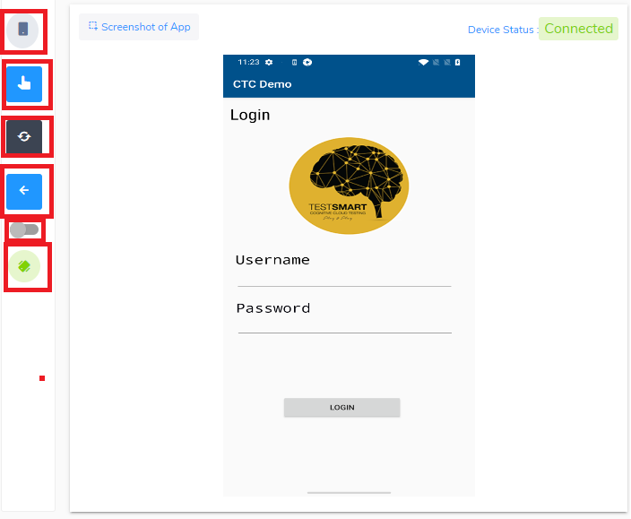

##  Build Test Scripts

<video width="600px" height="400px" controls>
  <source src="/_webrepo/_projectcreation/../../_media/_videos/_webVideos/Clip9-worksheet2.mp4" type="video/mp4">
</video>

<!-- create script video -->
