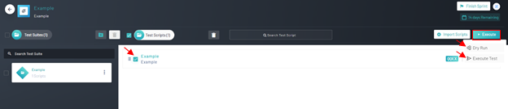
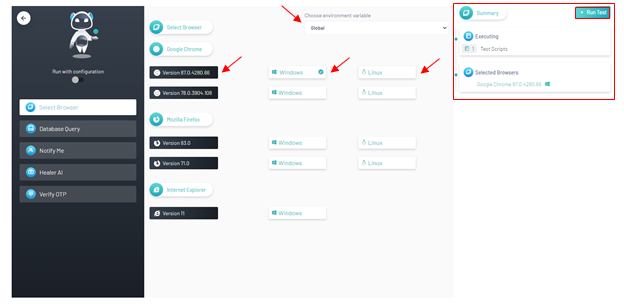
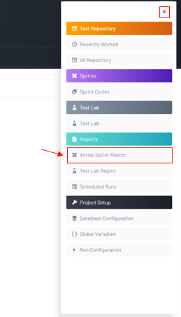
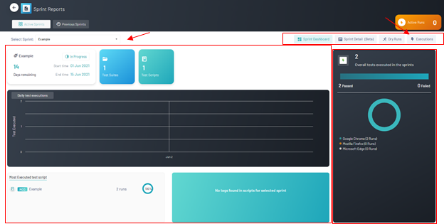
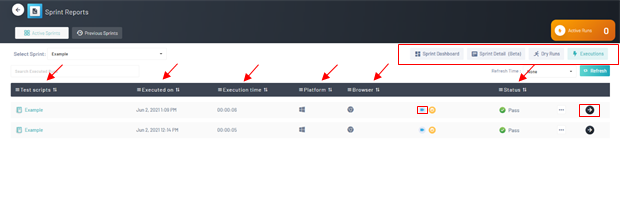
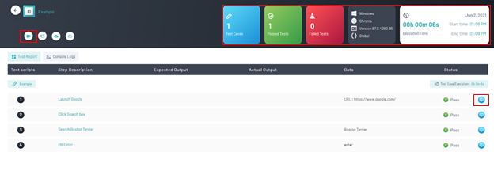

<h1 style="text-align: center; text-decoration:underline; font-weight: bold;">Web Repository</h1>

# Sprints
In the Sprints section, users will be able to connect their test scripts on Qyrus to real sprints being ran. The user imports test scripts from Test Repository into the Sprints section and then can organize them into Test Suites where they can then be executed.

## Test Execution & Reports <!-- {docsify-ignore} --> 
Test scripts in the Sprints section can be executed like any other script. The reports can be viewed in the specific Sprints Reports section.

### Prerequisites

- Previously Created Project
- Previously Created Sprint
- Previously Created Test Suite
- Previously Created Test Script
- Previously Imported Test Script
- Previously Started Sprint

### Setup
Navigate to ‘Web Repository’, select desired project, select desired ‘Sprint’, select desired ‘Test Suite’, and verify that a sprint is running. 

### Executions and reports

1. From the ‘Test Scripts’ page click the check box next to the desired test script(s) and click the ‘Execute’ button
2. From the drop-down menu select ‘Execute Test’
   - If a proper execution was not desired the user has the option to select a dry run as well.

3. Select an ‘Environment’
4. Select a ‘Browser’ version
5. Select a ‘UI’ version
6. Verify all selections in the summary tab
7. Click ‘Run Test’ button

8. Navigated back to the ‘Test scripts’ page, click the accordion menu button on the top right corner of the screen and under the reports tab, select ‘Active Sprint Report’

9. Navigated to the ‘Sprint Dashboard’ page there are a few things to note:
   1. The Initial page contains the data and demographics of a given script which can be filtered using the drop-down menu at the top of the screen. 
   2. The ‘Overall Executions’ table to the right details total tests executed within the desired sprint including demographics regarding the number of passed and failed tests
   3. The navigation menu on the top right corner of the screen provides buttons to the ‘sprint dashboard’, ‘Sprint detail’, ‘Dry runs’, and ‘Executions’.
10. After observing the sprint details, click the ‘Executions’ button on the navigation menu.
   - Note, if the test were not executed but rather a dry run, The ‘Dry Runs’ tab would be the button used for specific test script executions results.

11. Landing on the ‘Executions’ page, this contains a few key features:
   1. The navigation menu remains present
   2. The ‘Executions’ table in the center contains the script name, date of execution, execution time, platform, and Browser, alongside the execution status. 
   3. Note the live video feature can be accessed using the blue camera icon on the ‘Executions table’
12. Click the black ‘arrow’ key located on the far right of the desired test script

13. Verify the step-by-step execution of the test script
   1. The top nav bar highlights test specifics including, execution time, number of passed and failed attempts, User-Interface, Browser, and version. 
   2. Note the live video feature can also be accessed using the ‘Camera’ button on the top left corner of the screen
   3. Furthermore, using the ‘monitor’ button on the right of any given step, the screenshot feature can be accessed, displaying a screenshot of any given step.

