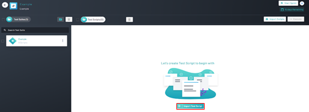
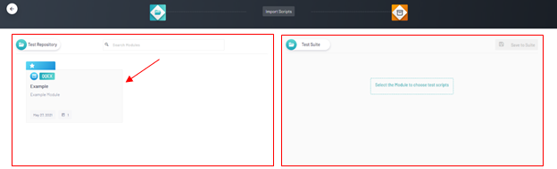
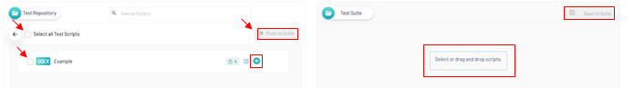
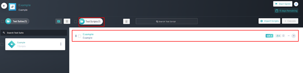

<h1 style="text-align: center; text-decoration:underline; font-weight: bold;">Web Repository</h1>

# Sprints
In the Sprints section, users will be able to connect their test scripts on Qyrus to real sprints being ran. The user imports test scripts from Test Repository into the Sprints section and then can organize them into Test Suites where they can then be executed.

## Importing Scripts <!-- {docsify-ignore} --> 

### Prerequisites
- Previously Created Project
- Previously Created Sprint
- Previously Created Test Suite
- Previously Created Test Script

### Setup
Navigate to ‘Web Repository’, select desired project, select desired ‘Sprint’, and select desired ‘Test Suite’

### Importing Scripts
1. Click ‘Import Test Script’ button

2. Click ‘Import Test Script’ button 
3. Upon Navigation to the ‘Import Scripts’ page there are a few things to note:
   1. Displayed on the left half of the screen are previously created modules within the test repository
   2. On the right-hand side is the created previously created test suite to which test scripts must be added
4. Click on the desired module

5. Select Desired Test Scripts and ‘Push to Suite’, options include:
   1. Employ drag and drop
   2. Use the blue ‘Plus’ icon found next to every test script
   3. Select each desired script using the check boxes on the left of the name and click the ‘Push to Suite’ button
6. Once Selected click ‘Save to Suite’ button

7. Upon navigation back to the ‘Test Scripts’ page, verify that the desired test script has been imported
   - The script should show up on the test scripts table in the center of the screen alongside a numerical indicator on the ‘Test Scripts’ heading

