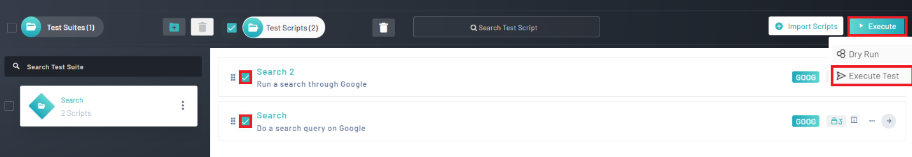
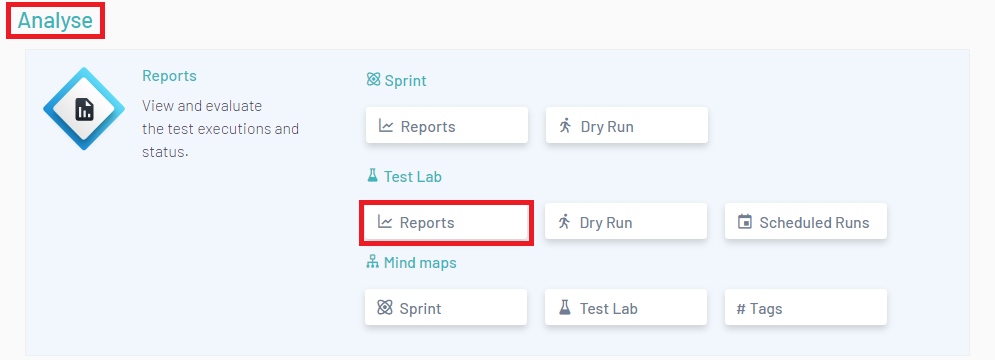
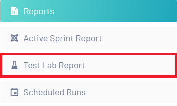
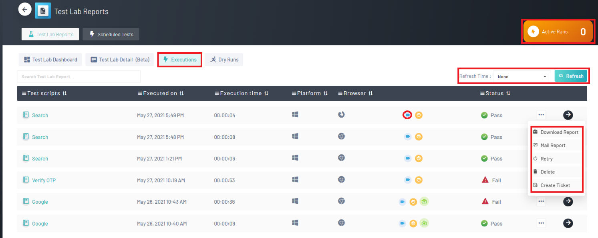
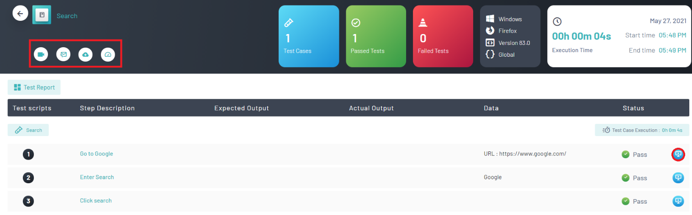

<h1 style="text-align: center; text-decoration:underline; font-weight: bold;">Web Repository</h1>

# Test Lab
In Test Lab, users are able to import their test scripts from Test Repository and then organize them into Test Suites they can then be executed. Here in Test Lab, users can also utilize the Schedule Run feature in order to schedule test runs in accordance with CI/CD pipelines.

## Test Execution & Reports <!-- {docsify-ignore} --> 
Users can execute their tests and view the results in the Reports section.

### Executing a Test
The first step the user will want to do is to click onto ‘Test Lab’. 

The user will then have a few options for executing tests

1. If a user wants to execute a run more than one script, the user can select the scripts they want to execute by clicking on the checkbox associated with that script. After all the desired scripts have been selected, click on ‘Execute’ and then ‘Execute Test’

2. The user can also navigate into their desired script by clicking on the right arrow associated with that script. Then, the user can select ‘Execute’ and ‘Execute Test’.

After clicking ‘Execute Test’, the user will be brought to the ‘Select Brower’ Page. The user can select between Google Chrome, Mozilla Firefox and Internet Explorer. They can choose more than one option.

Finally, click ‘Run Test’ to begin the Test Execution.

### Navigating to the Test Lab Reports
After a test has been executed in Test Lab, the user should navigate to the reports to view the results.  Viewing Test Lap Reports can be done in two ways.

1. After navigating into a project, look for the ‘Analysis’ header. Then, look for the sub header ‘Test Lab’. After finding ‘Test Lab’, there will be a button called ‘Reports’ the user can click on. 

2. Click the hamburger menu on the top right of the screen. Underneath the title ‘Reports’ there is a button called ‘Test Lab Reports’.

After clicking on the reports button, the user will be brought to the ‘Test Lab Reports Dashboard’. On this page the user can view their daily executed tests and overall test execution. They also have the option of navigating to ‘Scheduled Tests’, ‘Test Lab Detail (beta), ‘Executions’ and ‘Dry Runs’.

### View Executed Tests
After navigating to the Test Lab Reports, click on ‘Executions’. This will bring you to the reports of all the user’s executed tests

An overview of the page consists of: 

1. Active Executive Tests
1. Page Refresh
1. View of all Test Scripts
1. Playing a Script Video
1. Downloading the Report
1. Emailing the Report
1. Retrying the Test
1. Deleting the Report
1. Creating a Ticket

Also, by clicking on the arrow pointing to the right, the user can navigate into a specific test script. When viewing a test script, the user will have access to features such as:

1. A video of all executed scripts
1. Availability to mail reports
1. Availability to download reports
1. View performance metrics
1. Screenshots of each executed step

