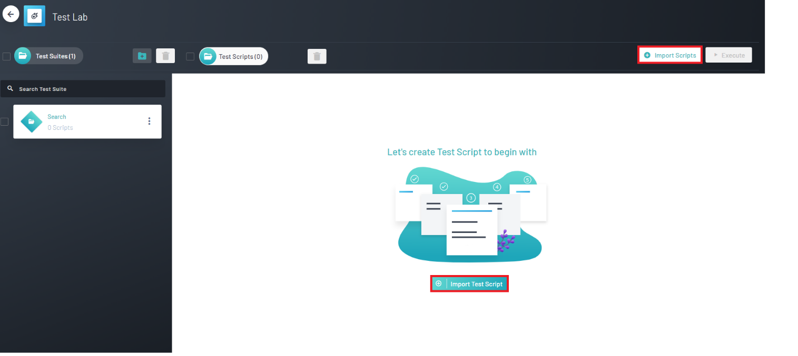
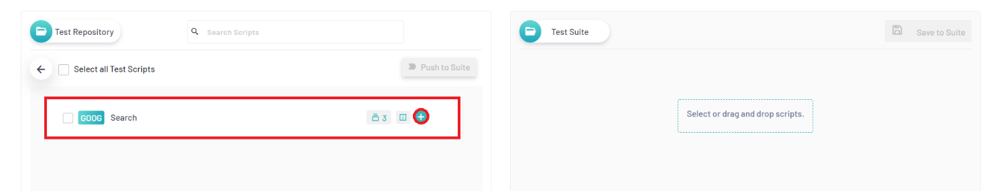
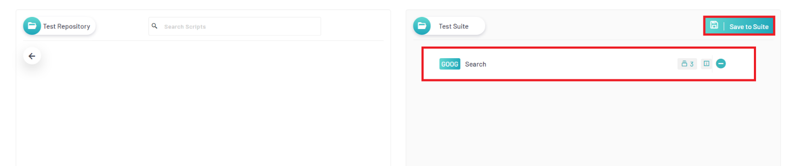

<h1 style="text-align: center; text-decoration:underline; font-weight: bold;">Web Repository</h1>

# Test Lab
In Test Lab, users are able to import their test scripts from Test Repository and then organize them into Test Suites they can then be executed. Here in Test Lab, users can also utilize the Schedule Run feature in order to schedule test runs in accordance with CI/CD pipelines.

## Importing Scripts into Test Lab <!-- {docsify-ignore} --> 

In order to import test scripts, the user must first create a Test Repository and add scripts. If this has not been completed yet, please refer to the [Test Repository](/_webrepo/_testrepo/ModuleCreation) documentation.

### Importing Process
1. Navigate into your project
1. Click on ‘Test Lab’

2. If a user has not imported a script yet, there will be two options available. 
    1. There will be a button that says ‘Import Test Script’ in the middle of the page 
    2. There will be a button that says ‘Import Scripts’ on the upper right of the page. 
    **Note:** If the user has imported a script, the upper right button will be the only one visible. 

3. After clicking on one of the two buttons, two panels will appear. The left panel will contain all the user's repositories. The right panel will contain all of the scripts the user will be importing. In order to import a script, the user must navigate into a test repository and click the plus sign on the script. After all the scrips a user would like to import have been added, click on ‘Save to Suite’ 

