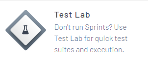
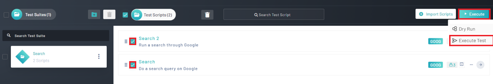
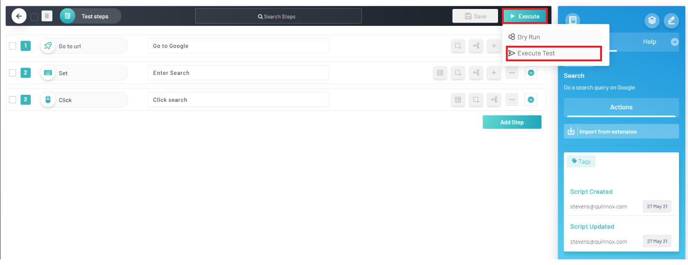
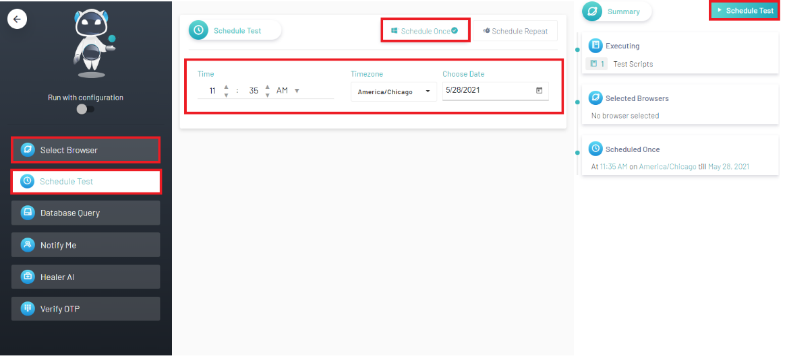
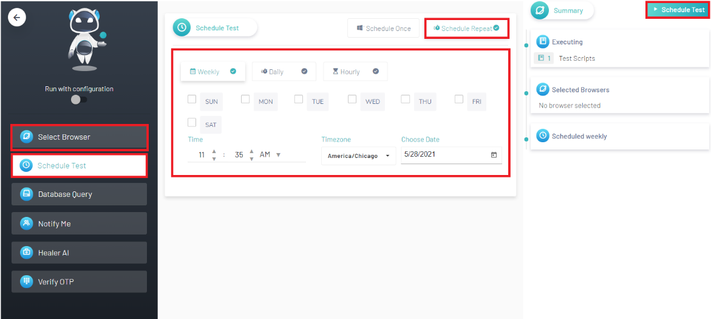
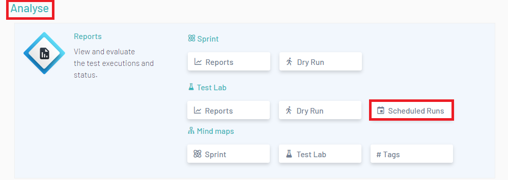
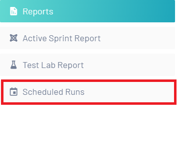

<h1 style="text-align: center; text-decoration:underline; font-weight: bold;">Web Repository</h1>

# Test Lab
In Test Lab, users are able to import their test scripts from Test Repository and then organize them into Test Suites they can then be executed. Here in Test Lab, users can also utilize the Schedule Run feature in order to schedule test runs in accordance with CI/CD pipelines.

## Scheduling Runs <!-- {docsify-ignore} --> 
Scheduling Runs allows the user to set a time and date for when a set of tests are executed.

### Creating Scheduled Runs
The first step the user will want to do is to click onto ‘Test Lab’.

From here, the user will have two options for scheduling a run

1. If a user wants to schedule a run for more than one script, the user can select the scripts they want to run by clicking on the checkbox associated with that script. After all the desired scripts have been selected, click on ‘Execute’ and then ‘Execute Test’

2. The user can also navigate into their desired script by clicking on the right arrow associated with that script. Then, the user can select ‘Execute’ and ‘Execute Test’

After clicking ‘Execute Test’, the user will be brought to the ‘Select Brower’ Page. The user can select between Google Chrome, Mozilla Firefox and Internet Explorer. They can choose more than one option.

After selecting a browser, click on ‘Schedule Test’, which is located on the black panel to the left. The user will then be presented with the options of doing a one-time scheduled test and/or repeat a scheduled test. The user then clicks whichever option is desired (Make sure there is a green checkbox next to your chosen option).

3. For a one-time scheduled test, the user must select a time, time zone and a date

4. For a repeated schedule test the user has the option to select weekly, daily, and/or hourly. For the weekly option the user selects the week, then selects the time, time zone and date. For the daily and hourly option, the user selects the time, time zone and date.

Click ‘Schedule Test’

### View Scheduled Runs
There are two ways to view your scheduled runs:

1. Navigate into a project and go under ‘Analysis’
   1. Under Analysis the user will see Test Lab
   1. Click ‘Scheduled Runs’

1. Navigate into a project and click the hamburger icon in the top right corner
   2. Under ‘Reports’ click on ‘Scheduled Runs’

After clicking on ‘Scheduled Runs’, the user will be able:

1. View All Scheduled Runs
1. View All Schedule Information
1. Pause Scheduled Test
1. Delete Scheduled Test

## Creating Scheduled Runs

<video width="600px" height="400px" controls>
  <source src="/_webrepo/_projectcreation/../../_media/_videos/_webVideos/Clip17-CreatingScheduledruns.mp4" type="video/mp4">
</video>

