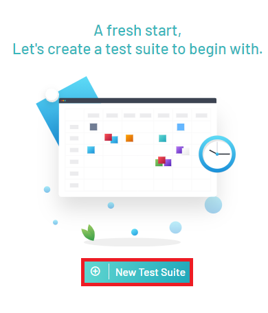
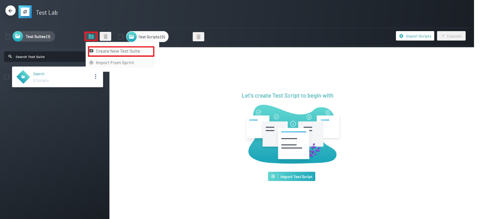
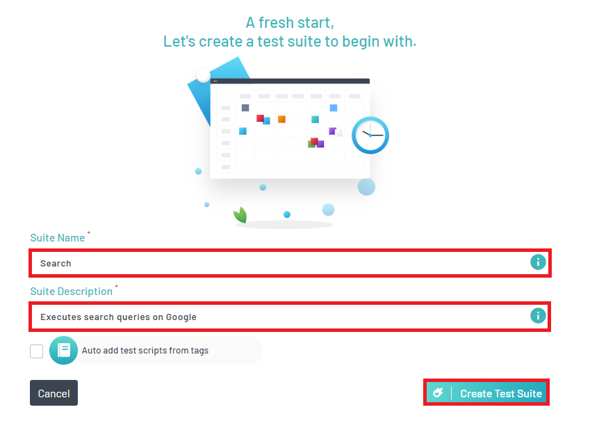

<h1 style="text-align: center; text-decoration:underline; font-weight: bold;">Web Repository</h1>

# Test Lab
In Test Lab, users are able to import their test scripts from Test Repository and then organize them into Test Suites they can then be executed. Here in Test Lab, users can also utilize the Schedule Run feature in order to schedule test runs in accordance with CI/CD pipelines.

## Creating Suites <!-- {docsify-ignore} --> 
A test suite is a collection of tests scripts. Test suites are used to organize test scripts.

### Creating a Test Suite
1. Navigate into a Web Repository project
2. Click on Test Lab

3. Create new Test Suite

   **Note:** If this is your first test suite, click on 'New Test Suite’ in the middle of the page

4. If you have a previously made test suite, you can add another by clicking on the folder icon on the top left and then clicking ‘Create New Test Suite’

5. After clicking the ‘Create a Test Suite’ button, you will be brought to a form. This form will prompt you to fill out a Suite Name and Suite Description. After those two fields are filled out click ‘Create Test Suite’

