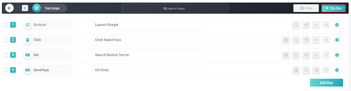
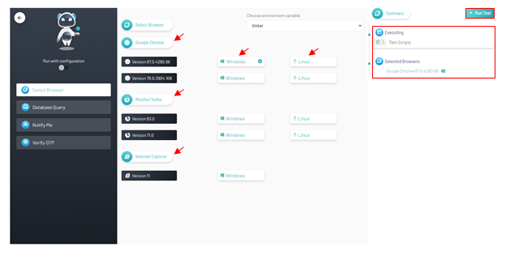
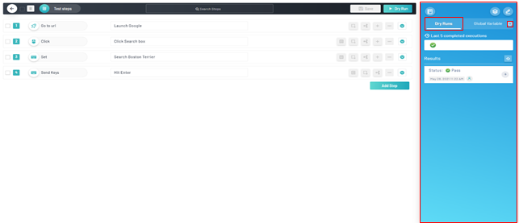
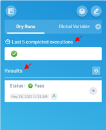

<h1 style="text-align: center; text-decoration:underline; font-weight: bold;">Web Repository</h1>

# Test Repository
Test Repository is where the user goes to create and store their test scripts. All test scripts will live within the Test Repository and then imported into Sprints and Test Lab in order to be utilized in different fashions.

## Dry Running <!-- {docsify-ignore} --> 
To view how a test script will execute before actually passing it into real-life testing environments, the user can Dry Run a test. This way, the user can see how the test script functions and can tweak the results as needed.
### Prerequisites
- Previously created project
- Previously created module
- Previously created test script
- Previously created steps

### Setup
 Navigate to ‘Web Repository’, select desired project, click ‘Test Repository’, select desired module and test script

### Dry Run

1. From the desired test script page, click ‘Dry Run’ button

2. Select desired ‘Environment Variable’
3. Select desired ‘Browser’
   1. Multiple browser versions available such as ‘Google Chrome’, ‘Mozilla Firefox’, and ‘Internet Explorer’
   2. Multiple OS versions available such as ‘Windows’ and ‘Linux’
4. ` `Verify selections under ‘Summary’ tab
5. Click Run test
   1. Run execution will automatically navigate you back to the test page

6. Use the side-bar menu on the right to navigate to the ‘Dry Runs’ tab. 
   1. Click the arrow button on the top right corner of the menu
   2. Locate and click on the ‘Dry Runs’ tab

7. Verify the test passed
   1. Refer to the quick bar of the ‘Last 5 completed executions’ 
   2. For a more detailed idea refer to the ‘Results’ tab which includes status, date, and time.

