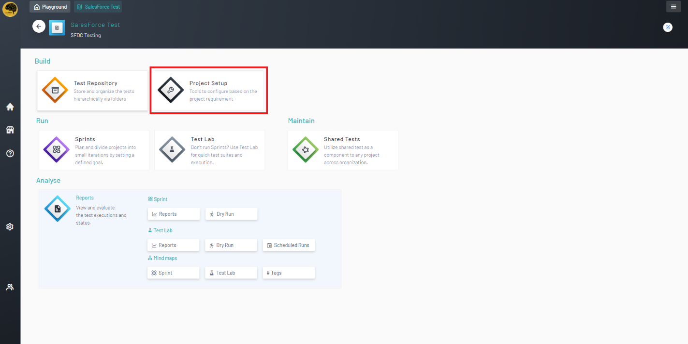
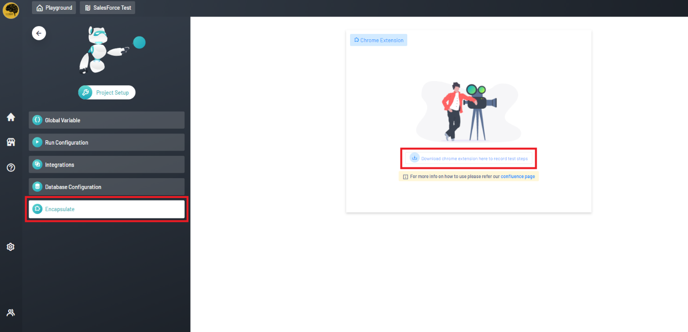
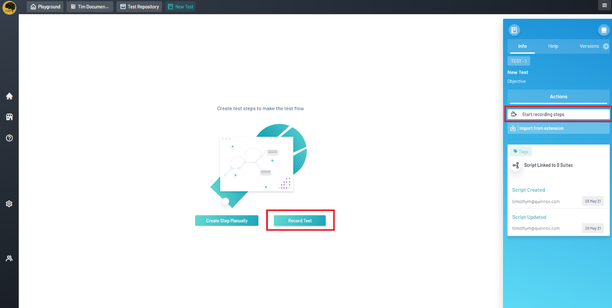
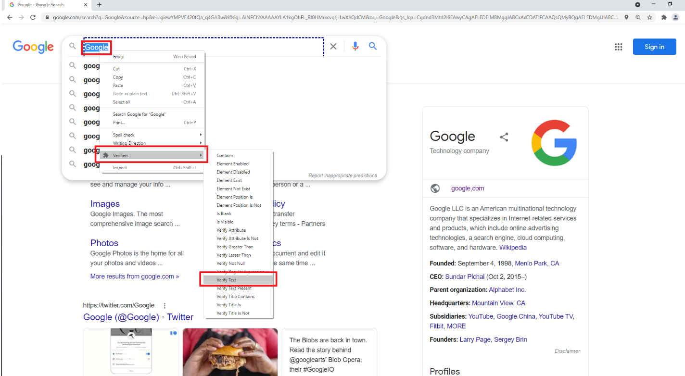
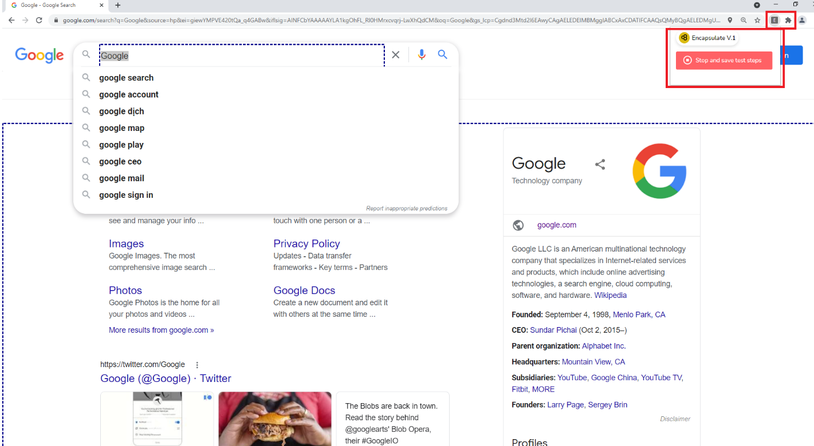
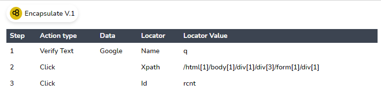
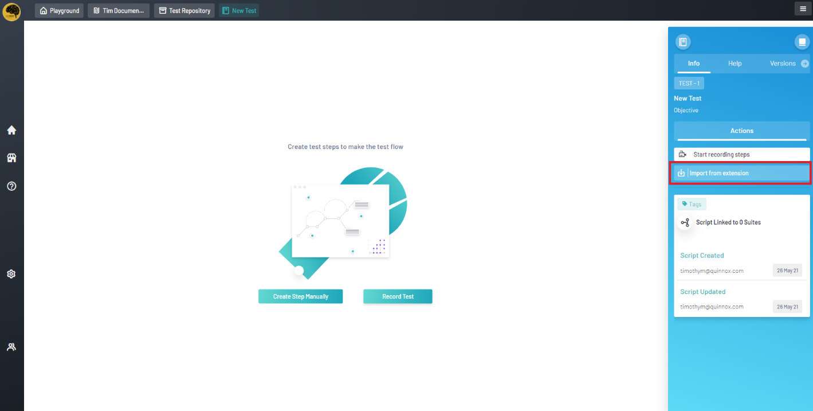

<h1 style="text-align: center; text-decoration:underline; font-weight: bold;">Web Repository</h1>

# Test Repository
Test Repository is where the user goes to create and store their test scripts. All test scripts will live within the Test Repository and then imported into Sprints and Test Lab in order to be utilized in different fashions.
 
## Recording Scripts with Encapsulate <!-- {docsify-ignore} --> 
Encapsulate is a Google Chrome extension that allows Qyrus to record actions live on the web page as they are performed by the user. The extension is downloadable on Qyrus.

### Prerequisites
- Basic knowledge in test building
### Download & Installation
To download the Encapsulate extension, go to the Project Setup section in Web Repository.

Afterwards, click on the Encapsulation option and click on the download link.

### Recording Test Steps
To start recording, create a new, fresh script and click the “Record Test” button in the middle of the screen or click the “Start Recording” button on the right panel.

Afterwards, a new tab will open. Go to the URL which leads to the web application that will be tested. The recorder will capture navigational actions. Highlight and right click an element on the page which the user would like to add Verifier Action Types to.

Clicking the extensions icon and on the Encapsulate extension will open a dialog box where the user can stop the test and prepare for import. After stopping, the user is given a list of the steps recorded.

### Importing Test Steps
To import the test steps recorded, simply click the “Import from Extension” button on the right panel.

