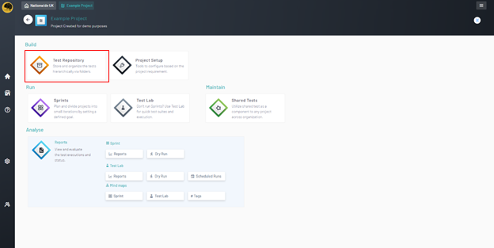
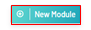
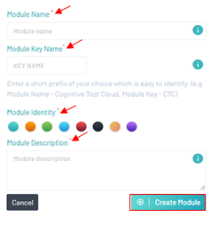

<h1 style="text-align: center; text-decoration:underline; font-weight: bold;">Web Repository</h1>

# Test Repository
Test Repository is where the user goes to create and store their test scripts. All test scripts will live within the Test Repository and then imported into Sprints and Test Lab in order to be utilized in different fashions.

## Creating Modules <!-- {docsify-ignore} --> 
Modules are designed to organize and file test scripts in a way that makes sense for the user. A single module can hold test scripts dedicated to staging or QA environments while another can hold test scripts dedicated to production environments.

### Prerequisites
- Basic knowledge on how to build a Project
- Previously Created Project

### Setup

1. Navigate to ‘Web Repository’ and select desired project
1. Under the ‘Build’ tab, Select ‘Test Repository’

### Module Creation

1. On the ‘Test Repository’ page click the ‘New Module’ button
1. Enter a module ‘Name’
1. Enter up to a four-character key for the ‘Module Key Name’
1. Select a color for the ‘Module Identity’
1. Enter a ‘Module Description’
1. Click Create Module

## Create a Module

<video width="600px" height="400px" controls>
  <source src="/_webrepo/_projectcreation/../../_media/_videos/_webVideos/Clip3-Createmodule.mp4" type="video/mp4">
</video>