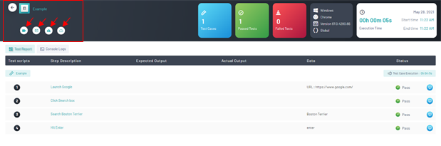
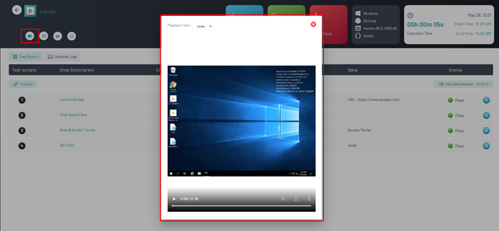
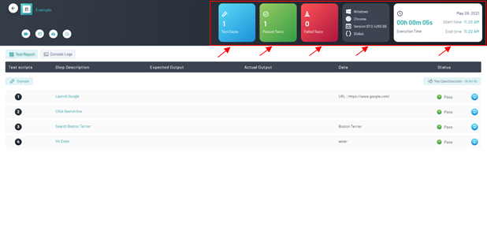
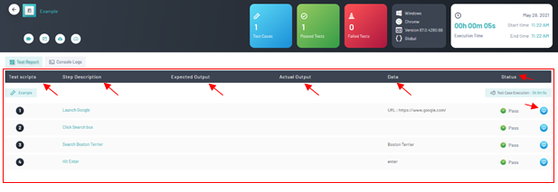
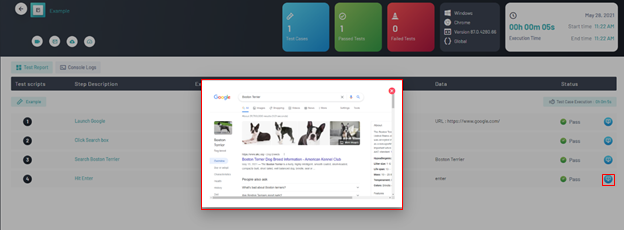

<h1 style="text-align: center; text-decoration:underline; font-weight: bold;">Web Repository</h1>

# Test Repository
Test Repository is where the user goes to create and store their test scripts. All test scripts will live within the Test Repository and then imported into Sprints and Test Lab in order to be utilized in different fashions.

## Reports <!-- {docsify-ignore} --> 
In the reports section the user can view the results of their automated tests.

### Prerequisites
- Previously created project
- Previously created module
- Previously created test script
- Previously ‘Dry Run’ executed

### Setup
Navigate to ‘Web Repository’, select desired project, click ‘Test Repository’, select desired module and test script, navigate to ‘Dry Runs’ tab.

### Viewing Reports
1. Under the ‘Dry Runs’ menu tab, locate the ‘Results’ section for the previously executed ‘Dry Run’
2. Click the arrow on the right side of the desired ‘Dry Run’

3. The Reports page can be divided into three important sections
   1. The results bar, the metrics bar, and the step execution table.
4. The results bar is located on the top left corner of the page as part of the top navigation bar. It has a line of buttons which include:
   1. A button to produce a video recording of the given execution 
   1. A button to mail the report
   1. A button to download the report
   1. A button to display execution specific metrics  

5. It is important to note the video recording feature 
   1. One of the most unique and widely used features by clicking the video button it will display the live video of the test execution
   1. The video speed, size, and volume can be toggled alongside pausing functionality anytime.
   1. The video can also be exported and saved for documentation purposes

6. The metrics bar is located to the right of the results bar within the top navigation bar. It is comprised of multiple metrics including:
   1. Number of total test executions
   1. Number of passed tests
   1. Number of failed tests
   1. Previously selected test specifics
      1. Browser, Operating System, Version, environment
   1. Time metrics
      1. Total execution time, start time, end time, and date

7. The executions table is located on the center of the page and consists of the per step executions of the given test. The table consists of:
   1. Each individually listed step
   1. Each step’s description
   1. Each step’s expected output (if applicable)
   1. Each step’s Actual output (if applicable)
   1. The step data
   1. A button to display screenshots of a given step

8. It is important to note the screenshot feature
   1. One of the most unique and widely used features by clicking on the screenshot button it will display a screenshot of the step being executed. 
   1. Screenshots are available for every step of the test script, but can also be toggled for desired use only

## Dry Running, Results, & Reports

<video width="600px" height="400px" controls>
  <source src="/_webrepo/_projectcreation/../../_media/_videos/_webVideos/Clip14-DryrunningReportsResults.mp4" type="video/mp4">
</video>