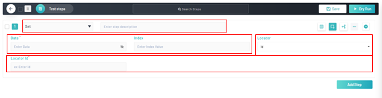
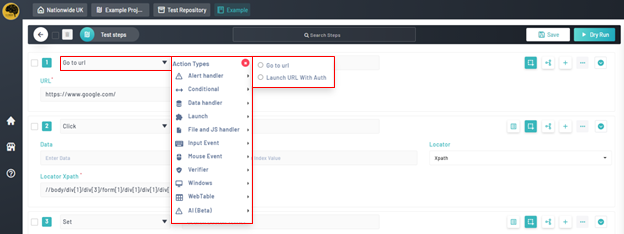
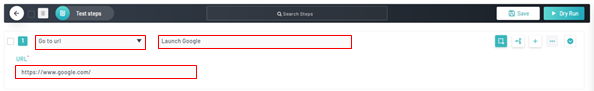
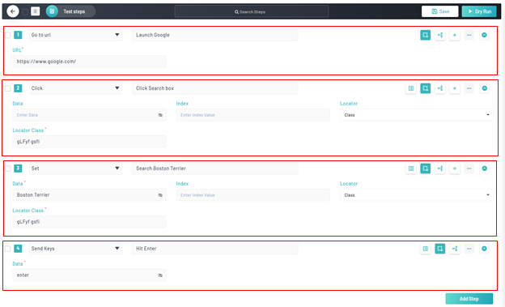

<h1 style="text-align: center; text-decoration:underline; font-weight: bold;">Web Repository</h1>

# Test Repository
Test Repository is where the user goes to create and store their test scripts. All test scripts will live within the Test Repository and then imported into Sprints and Test Lab in order to be utilized in different fashions.

## Creating Steps<!-- {docsify-ignore} --> 
These individual steps are the actions that will take place within the test script.

### Prerequisites
- Previously created project
- Previously created module
- Previously created test script

### Setup

1. Navigate to ‘Web Repository’, select desired project, click ‘Test Repository’, and select desired module
1. Select desired test script and click the arrow button on the far right
1. Click ‘Create Step Manually’ button  

### Background

1. Test steps are comprised of three important components: action and description, step elements, and locator elements. 
1. The action and description, alongside locator and elements will remain consistent regardless of a given step
1. The step elements are contingent upon the step being performed
   1. Different action types may require additional data inputs for execution
   1. Different locator types may contain different input specifics

## Step Creation page

<video width="600px" height="400px" controls>
  <source src="/_webrepo/_projectcreation/../../_media/_videos/_webVideos/Clip5-Stepcreationpage.mp4" type="video/mp4">
</video>

### Create Steps

**Note: Example script being made.**

1. A very common test script and the one we will be creating is a search script. 
2. The first step we are going to create, and one of the most common first steps is a launch
   1. A launch tells the browser what domain we are heading to, and testing. 
   2. To navigate to the proper action click the dropdown à “Launch” à “Go to url"

3. Next enter a relevant description 
4. Lastly copy and paste the following into the url
   1. <https://www.google.com/>

5. Click the ‘Add step’ button and for the following steps copy the screenshot provided.

## Steps Overview

<video width="600px" height="400px" controls>
  <source src="/_webrepo/_projectcreation/../../_media/_videos/_webVideos/Clip6-Stepsoverview.mp4" type="video/mp4">
</video>

