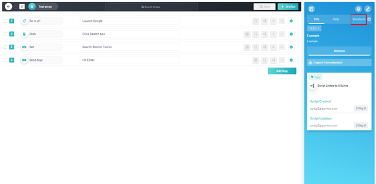
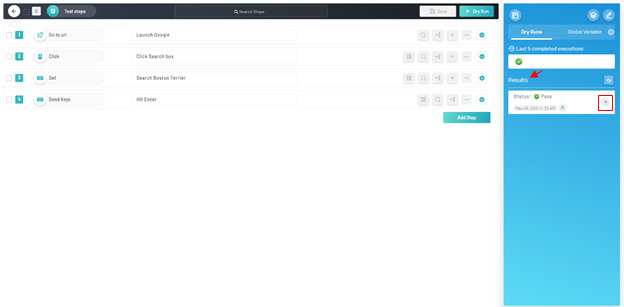
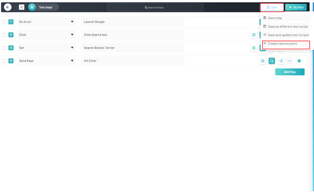
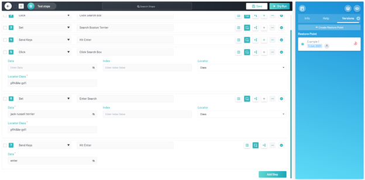

<h1 style="text-align: center; text-decoration:underline; font-weight: bold;">Web Repository</h1>

# Test Repository
Test Repository is where the user goes to create and store their test scripts. All test scripts will live within the Test Repository and then imported into Sprints and Test Lab in order to be utilized in different fashions.

## Versioning & Restoring Scripts <!-- {docsify-ignore} --> 
A user can version their script in the Test Repository in order to have restore points to be able to revert to. This allows the user a wider dynamic range of test script usage.

### Prerequisites
- Previously created project
- Previously created module
- Previously created test script
- Previously ‘Dry Run’ executed

### Setup
Navigate to ‘Web Repository’, select desired project, click ‘Test Repository’, and select desired module and test script.

### Reports
1. Under the ‘Dry Runs’ menu tab, navigate to the ‘Versions’ tab on the blue navigation menu to the right.

2. Make sure your tests are saved, and click ‘Create Restore Point’ button

3. Conversely, the ‘Create Restore Point’ button can be found on the ‘Save’ tab

4. Enter a ‘Restore Point Name’
5. Enter a ‘Restore Point Description’
6. Click ‘Create Restore Point’ button

7. Verify Restoration point
   1. Upon creation the user should automatically be navigated to the ‘Versions’ tab 
   1. The recently created restore point will be shown under the ‘Restore Point’ subheading

8. Copy the steps on following test scripts and save

9. Navigate once again to the previously created ‘Restoration’ in the ‘Versions’ tab of the blue navigation menu on the right

10. Click the red icon on the right to ‘Reset’
11. Click ‘Yes’ on the pop-up window
   1. Upon Reset, note that the test script is now restored to the original version prior to the added and saved test steps
   1. The feature works conversely as well. If steps were deleted after a ‘Version’ was created those steps would be present upon a ‘Restore’

## Versioning and Restoring Scripts

<video width="600px" height="400px" controls>
  <source src="/_webrepo/_projectcreation/../../_media/_videos/_webVideos/Clip15-Versioning.mp4" type="video/mp4">
</video>

