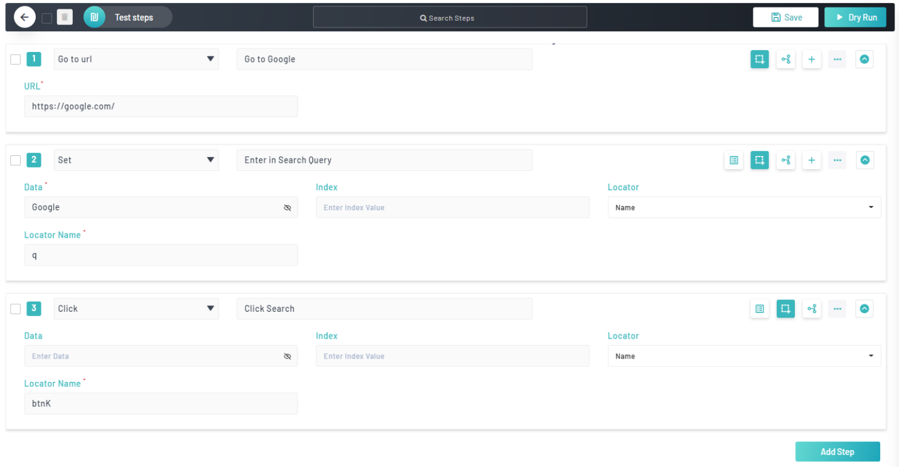
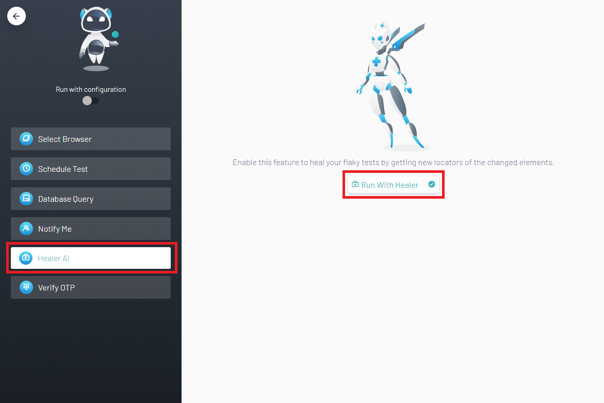
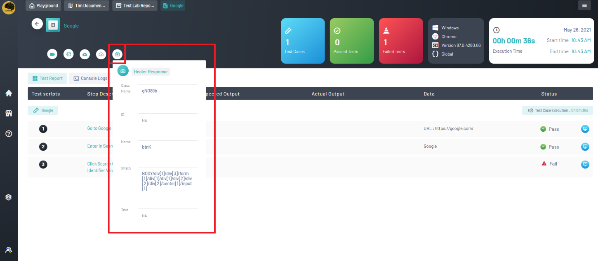

<h1 style="text-align: center; text-decoration:underline; font-weight: bold;">Web Repository</h1>

# Other
## Using Healer <!-- {docsify-ignore} --> 
Healer is an advanced AI tool that users can enable before they execute their test scripts. It helps prevent test flakiness and brittleness. Healer gives a response on a failing test that provides the user with the element information needed in order to fix their broken test. Below will be an example of running tests with Healer enabled.
### Prerequisites
- Basic knowledge in test building
- Knowledge on how to import scripts to Test Lab
- Knowledge on using Web Repository
### Setup
1. Navigate to the Test Repository in Web Repository
2. Create an example project, module, and test script
3. Add the three test steps below to the test script and save it:

4. Navigate to the Test Lab in Web Repository
5. Create an example suite and import the example test script
6. Navigate inside the test script and click on the Execute button and Execute Test option
7. Choose the preferred browser to execute on
8. Navigate to the Healer AI option and click the Run with Healer button:

9. Run the test, wait for it to finish executing, and make sure it passes (this is to baseline your test)

### Usage
1. Navigate back to the test script in Test Lab and change the element locator name from “btnK” to “b” or some other INCORRECT value
1. Execute the test script again with Healer enabled the same as last time
1. Once finished executing, the test will fail on clicking the search button
1. View the report and click on the Healer button in order to view the Healer Response:

## Healer Demonstration

<video width="600px" height="400px" controls>
  <source src="/_webrepo/_projectcreation/../../_media/_videos/_webVideos/Clip20-Healer.mp4" type="video/mp4">
</video>

