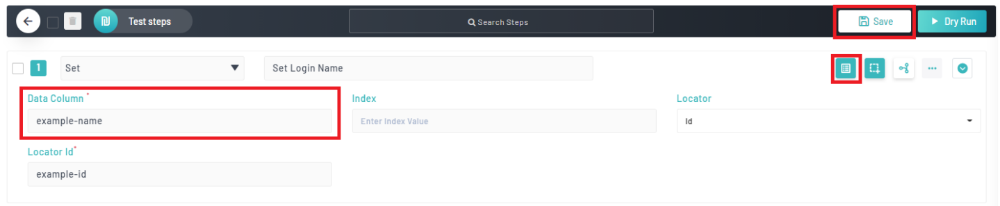
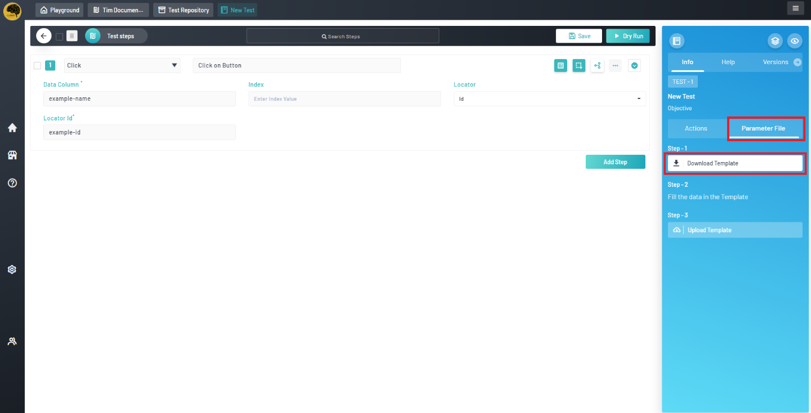
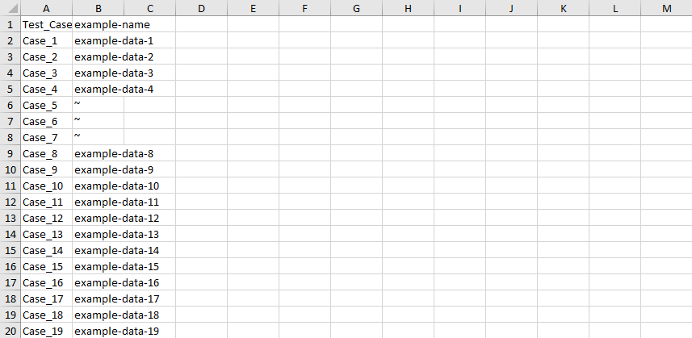
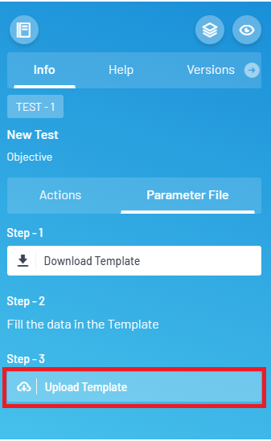
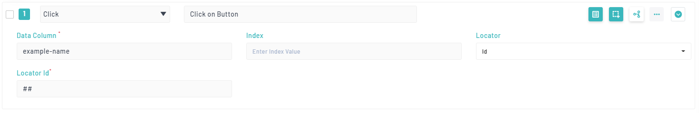

<h1 style="text-align: center; text-decoration:underline; font-weight: bold;">Web Repository</h1>

# Other
## Parameterizing Tests <!-- {docsify-ignore} --> 
Qyrus allows for steps to be parameterized. This allows the user a more dynamic range of test usage, allowing for one test to cover different test cases or scenarios.
### Prerequisites
- Basic knowledge in test building
### Marking Steps for Parameterization
To mark a step for parameterization, simply click the “Parameterize” button and ensure it is highlighted. Then, give a name for the parameter data column. This will show up in the downloaded parameter file. Make sure to save the test before continuing.

### Downloading, Adding Data, and Uploading File
Afterwards the user will be able to download the parameter file. To do this, on the right panel, go to the “Parameter File” tab and then click the “Download Template” button.

Afterwards, a file formatted as <Your-Test-Case-Name>\_Data.xslx will be downloaded. Open this file and there will be a column named Test\_Case. The other columns will be all of the Data Column names that were given in the steps specified as parameterized.

Enter test case names under the Test\_Case column. Each test case will use its associated data in the example data column(s) to the right of it.

If a user wants to skip a step in a test case, they can provide the ~ symbol as the data.

Finally, upload the file to Qyrus by clicking the “Upload Template” button and choose the file.

Note: To parameterize clicks, make sure to specify what locator type will be used and then provide “##” in the locator value field as shown below:
